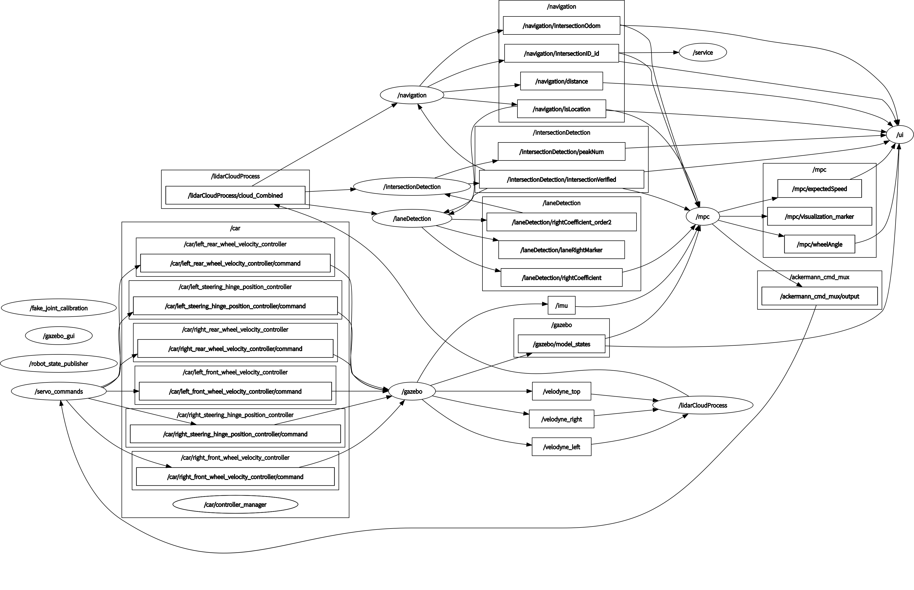
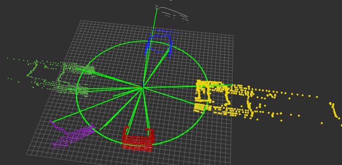
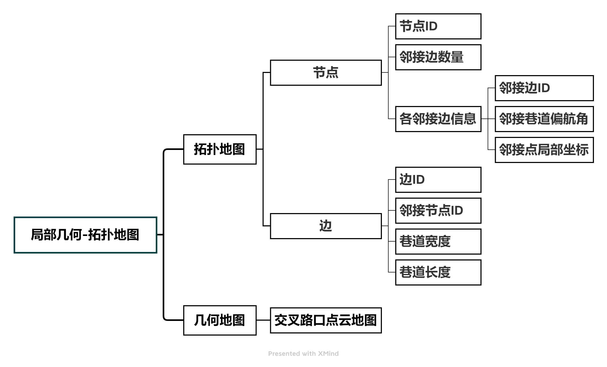
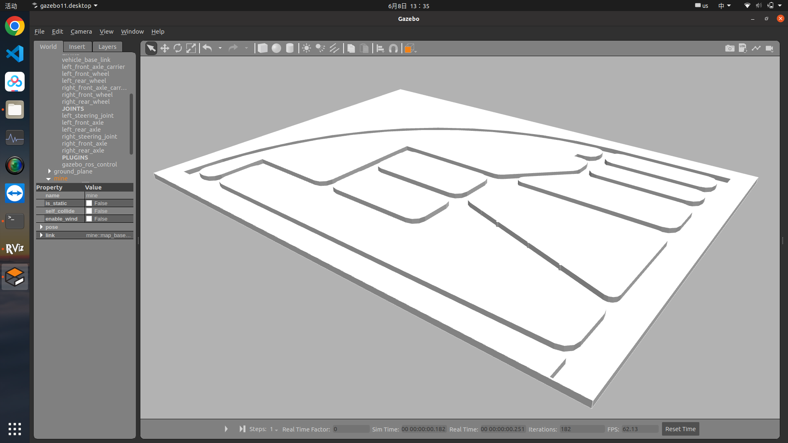
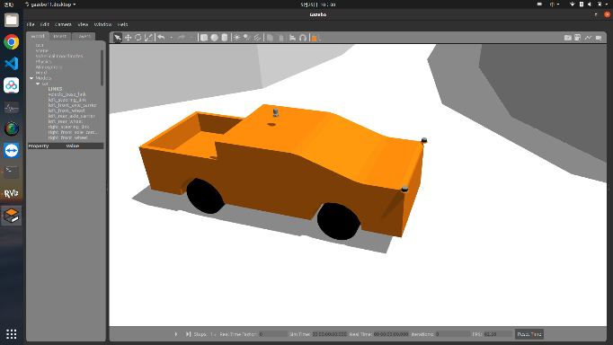
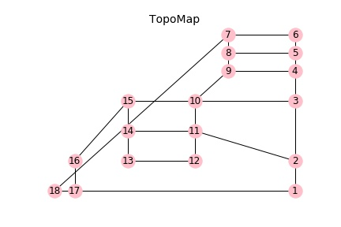
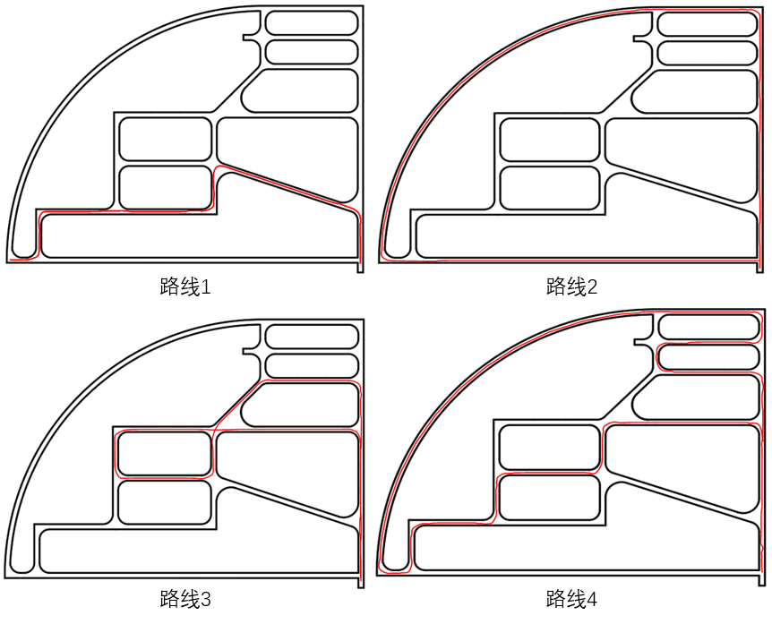
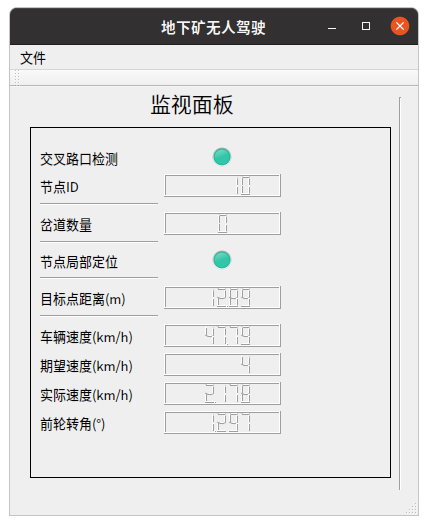

# 地下矿自动驾驶软件

## 一、软件介绍：

​	本软件用于地下隧道环境自动驾驶，具激光雷达点云融合模块、交叉路口检测模块、车道线拟合模块、交叉路口定位模块、MPC车控模块等。在gazebo中搭建了地下狂环境和车辆模型，可不依赖于额外的定位路侧设备（如5G、UWB基站等），仅依靠车载激光雷达及IMU完成单车智能驾驶。

**作者**：Rain649	**版本**：v3.0



<center>软件框架</center>

## 1.点云处理模块（融合3个激光雷达数据，并去除车辆、地面点）

#### 1).源码文件：

```
lidarCloudProcess.cpp
```

#### 2).发送topic

| topic                               | type                                                 | description                        |
| ----------------------------------- | ---------------------------------------------------- | ---------------------------------- |
| "/lidarCloudProcess/cloud_Combined" | [sensor_msgs::PointCloud2](sensor_msgs::PointCloud2) | 融合后的，去除地面点、车辆点的点云 |

## 2.交叉路口检测



<center>交叉路口检测效果</center>

#### 1).源码文件：

```
intersectionDetection.cpp
```

#### 2).发送topic

| topic                                         | type                          | description            |
| --------------------------------------------- | ----------------------------- | ---------------------- |
| "/intersectionDetection/intersectionVerified" | [std_msgs::Bool](std_msgs::Bool) | 判断是否位于交叉路口处 |

## 3.车道线拟合

#### 1).源码文件：

```
laneDetection.cpp
```

#### 2).发送topic

| topic                             | type                                                    | description                                          |
| --------------------------------- | ------------------------------------------------------- | ---------------------------------------------------- |
| "/laneDetection/leftCoefficient"  | [std_msgs::Float32MultiArray](std_msgs::Float32MultiArray) | 左侧墙壁3阶曲线拟合系数                              |
| "/laneDetection/rightCoefficient" | [std_msgs::Float32MultiArray](std_msgs::Float32MultiArray) | 右侧墙壁3阶曲线拟合系数                              |
| "/laneDetection/leftRange"        | [std_msgs::Float32MultiArray](std_msgs::Float32MultiArray) | 左侧曲线拟合x轴范围（两个值：0是轴正向、1是x轴负向） |
| "/laneDetection/rightRange"       | [std_msgs::Float32MultiArray](std_msgs::Float32MultiArray) | 右侧曲线拟合x轴范围（两个值：0是轴正向、1是x轴负向） |
| "/laneDetection/Distance"         | [std_msgs::Float32MultiArray](std_msgs::Float32MultiArray) | 左、右侧墙壁距离（两个值：0左侧、1右侧）             |

## 4.节点定位

#### 1).源码文件：

```
navigation.cpp
```

```
intersectionLocation.cpp
```

```
topoMap.cpp
```

```
intersectionLocation.h
```

```
topoMap.h
```

#### 2).发送topic

| topic                          | type                                  | description                |
| ------------------------------ | ------------------------------------- | -------------------------- |
| "/navigation/intersectionOdom" | [nav_msgs::Odometry](nav_msgs::Odometry) | 交叉路口处的定位           |
| "/navigation/intersection_id"  | [std_msgs::Int32](std_msgs::Int32)       | 车辆下一个经过的交叉路口ID |

#### 3).接收topic

| topic        | type                                                   | description                                                  |
| ------------ | ------------------------------------------------------ | ------------------------------------------------------------ |
| "/pathArray" | [std_msgs::Int32MultiArray](std_msgs::Int32MultiArray) | 需要获得规划的路径，路径数组第一个值需要设定为第一个经过节点前最后经过的节点 |

## 5.拓扑地图



<center>局部几何-拓扑地图结构</center>

#### 1).源码文件：

```
topoMap.h
```

```
topoMap.cpp
```

#### 2).函数

```
//构建拓扑地图
TopoMap loadMap(const std::string &vertexFilePath, const std::string &edgeFilePath, const std::string &pcdFilePath);
1.vertexFilePath为Edge.yaml路径
2.edgeFilePath为Vertex.yaml路径
3.pcdFilePath为节点点云pcd文件夹路径
```

## 二、安装插件：

1. 安装gps插件：sudo apt-get install ros-melodic-geographic-msgs
2. 安装velodyne激光雷达驱动：sudo apt-get install ros-melodic-velodyne-*
3. 安装阿克曼转向驱动：sudo apt-get install ros-melodic-ackermann-msgs
4. 安装弹性元件驱动：sudo apt-get install ros-melodic-effort-controllers

## 三、依赖介绍

| 依赖项   | 版本 |
| -------- | ---- |
| PCL      | 1.8  |
| EIGEN    | 3    |
| yaml-cpp | 最新 |

## 四、编译与运行

1. 转到工作空间目录
2. 使用catkin_make编译
3. ui界面需使用qt creator编译

## 五、运行

1. 启动roscore：roscore
2. 启动仿真模型及感知程序： roslaunch perception mineSimulation.launch
6. 启动定位导航程序：roslaunch perception navigation.launch
4. 启动ui监控界面： src/ui/bin/mine
5. gazebo点击开始运行按钮
6. (可选)启动手动控制车辆程序：rosrun teleop_twist_keyboard teleop_twist_keyboard.py

## 六、示例

### 1.gazebo中搭建如下图所示的地下狂仿真环境及车辆模型



<center>地下矿仿真环境</center>



<center>车辆模型</center>

### 2.构建拓扑地图



<center>拓扑地图</center>

### 3.制定测试路线进行测试

路线1： 1->2->11->12->13->16->17->18

路线2： 1->2->3->4->5->6->7->18->17->1

路线3： 1->2->3->4->9->10->11->14->15->10->3->2->1

路线4： 2->3->4->9->8->5->6->7->18->17->16->13->14->11->10->3->2->1

测试结果如图所示，红线表示车辆运动轨迹：



<center>自动驾驶测试轨迹</center>

### 4.UI监控界面



<center>UI监控界面</center>

